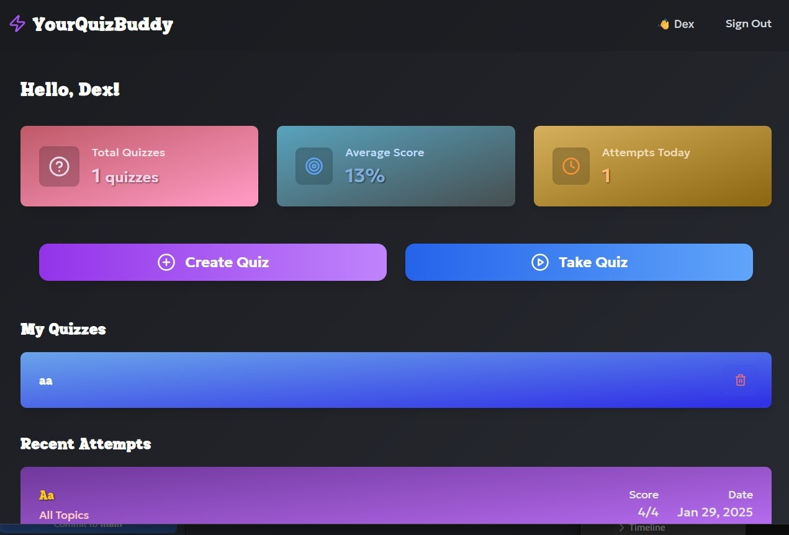

<div align="center">
  
</div>

# YourQuizBuddy - Your Ultimate Quiz Companion! 🚀

Welcome to YourQuizBuddy, a platform to create custom quizzes and track your progress and learning over time ✨

## 🌟 Features That'll Blow Your Mind

- 🎯 **Smart Quiz Creation**: Craft quizzes with text and image questions
- 🎨 **Beautiful UI/UX**: Modern, responsive design that's a feast for the eyes
- 📊 **Real-time Progress**: Track your performance with stunning analytics
- 🌈 **Multi-topic Support**: Create quizzes across various subjects according to your choice
- 🎮 **Interactive Experience**: Engaging animations and smooth transitions
- 🔄 **Instant Feedback**: Add explanation to remind yourself much better
- 📱 **Fully Responsive**: Perfect on desktop, tablet, or mobile!

<div align="center">
  
</div>

## 🚀 Tech Stack of the Future

- **Frontend**: Next.js 13+ with App Router & TypeScript
- **Styling**: Tailwind CSS & Framer Motion for those buttery-smooth animations
- **Backend**: Firebase - because real-time is the only time!
- **Authentication**: Firebase Auth - Secure and seamless

## 🎮 Getting Started

1. Clone this repo:
```bash
git clone https://github.com/dexonclouds/yourquizbuddy.git
cd yourquizbuddy
```

2. Install the magic dependencies:
```bash
npm install
# or
yarn install
```

3. Set up your environment variables (more on this below)

4. run the development server:
```bash
npm run dev
# or
yarn dev
```

5. Visit [http://localhost:3000](http://localhost:3000) and be amazed! 🎉

## 🔐 Environment Variables

Create a `.env.local` file with these essential ingredients:

```env
# Firebase Configuration
NEXT_PUBLIC_FIREBASE_API_KEY=your_firebase_api_key
NEXT_PUBLIC_FIREBASE_AUTH_DOMAIN=your_firebase_auth_domain
NEXT_PUBLIC_FIREBASE_PROJECT_ID=your_firebase_project_id
NEXT_PUBLIC_FIREBASE_STORAGE_BUCKET=your_firebase_storage_bucket
NEXT_PUBLIC_FIREBASE_MESSAGING_SENDER_ID=your_messaging_sender_id
NEXT_PUBLIC_FIREBASE_APP_ID=your_app_id
NEXT_PUBLIC_FIREBASE_MEASUREMENT_ID=your_measurement_id
# imgbb for storing image free
NEXT_PUBLIC_IMGBB_API_KEY=ace2e7778b881c86cb6235c8dca8bb47
```

## 🚀 Deployment Options

### 🔺 Vercel Deployment
1. Connect your GitHub repository to Vercel
2. Add your environment variables in Vercel's project settings
3. Deploy without any extra setup! 🎉

### 🌐 Cloudflare Pages Deployment
1. Connect your repository to Cloudflare Pages
2. Set up your environment variables in the Pages settings
3. Choose framework: Next.js and it will automatically generate a build command for you
4. Deploying 1st time will give error and cloudflare will ask you to put Compatibility flags
"nodejs_compat" . you will find it settings -> runtime -> compatibility flags
5.Then you are ready to go!

## 🔥 Firebase Setup

1. Create a new Firebase project at [Firebase Console](https://console.firebase.google.com)
2. Enable Authentication (google)
3. Create a Firestore Database
4. Set up your security rules:
```javascript
rules_version = '2';
service cloud.firestore {
  match /databases/{database}/documents {
    match /quizdata/{document} {
      allow read: if true;
      allow write: if request.auth != null;
    }
    
    match /attemptdata/{document} {
      allow read: if true;
      allow write: if request.auth != null;
    }
  }
}
```

## 📚 Database Structure

Your Firestore collections should look like this:

```
- quizdata/
  - {quizId}/
    - subject: string
    - topic: string
    - created_by: string
    - quizdata: array
      - question: string
      - options: array
      - correct_option: string
      - explanation: string
      - question_score: number

- attemptdata/
  - {attemptId}/
    - userId: string
    - quizId: string
    - startTime: timestamp
    - endTime: timestamp
    - score: number
    - answers: array
```

## 📜 License

MIT License - Spread the joy of learning! Feel free to use, modify, and share this project! 🚀

---

Made with ❤️ by a hobbyist developer
